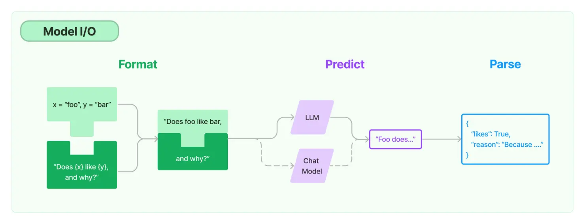

# Day 2：模型IO与数据连接
## 一、 Model I/O
LangChain的Model I/O模块提供了标准化、可扩展的接口，用于实现与大语言模型(LLM)的外部集成。该模块通过抽象化的设计简化了与各类大模型的交互流程，主要包含三个核心组件：
1. 模型输入(Prompts) - 处理与模型的交互输入
2. 模型输出(Outputs) - 处理模型的响应输出
3. 模型本身(Models) - 提供统一的模型调用接口



对于这个模块，LangChain抽象出了"Chain"的概念，通过链式处理简化和增强交互流程。一个完整的Chain包含三个关键处理阶段：


### 1. Format（格式化阶段）
- 功能：使用Prompt Templates（提示模板）管理模型输入
- 实现方式：
    - 提供模板化输入管理
    - 支持动态变量插入
    - 可定制不同场景的提示模板
- 优势：使提示工程更加系统化和可复用

#### 1.1 什么是 Prompt Template？
Prompt Template 是一种预定义的提示生成方法，其核心是一个模板字符串。该模板字符串中包含了固定的文本和占位符变量，通过传入用户提供的参数，这些变量会被动态替换，最终生成一个完整的提示。

#### 1.2 Prompt Template 的主要组成部分：

- 指令部分：对语言模型的基本指令，例如“扮演命名顾问”等。
- 变量占位符：用花括号 {} 标记，用于动态插入用户输入的参数，如 {product}、{adjective} 等。
- Few-Shot Examples（可选）：一组示例对话或示例问题与答案，作为上下文帮助模型理解任务要求，从而生成更准确的响应。

#### 1.3  为什么需要使用 Prompt Template？
- 简化提示设计：对于同类型的任务，不需要每次都从头编写完整提示，通过模板即可复用已有结构。
- 灵活性和动态性：支持传入任意数量的变量，便于根据不同场景和输入动态生成提示内容。
- 提升模型效果：通过插入 Few-Shot Examples，模型可以借助示例学习如何回答问题，从而提高生成响应的质量。

#### 1.4 如何创建 Prompt Template？
**1. 使用 PromptTemplate 类创建模板**
你可以直接使用 PromptTemplate 类定义一个硬编码提示，并指定需要的输入变量。例如：

```python
from langchain import PromptTemplate

# 定义一个模板，包含一个变量 {product}
template = """
I want you to act as a naming consultant for new companies.
What is a good name for a company that makes {product}?
"""

prompt = PromptTemplate(
    input_variables=["product"],
    template=template,
)
result = prompt.format(product="colorful socks")
print(result)
```

输出结果为：
```text
I want you to act as a naming consultant for new companies.
What is a good name for a company that makes colorful socks?
```

**2. 自动推断输入变量**
如果不想手动指定 input_variables，可以使用 from_template 类方法。LangChain 会根据模板自动推断需要的变量：

```python
template = "Tell me a {adjective} joke about {content}."
prompt_template = PromptTemplate.from_template(template)
print(prompt_template.input_variables)
# 输出: ['adjective', 'content']
print(prompt_template.format(adjective="funny", content="chickens"))
# 输出: "Tell me a funny joke about chickens."
```

**3. 从文件中读取 from_file 方法**

该方法用于从文件加载提示模板。你只需传入模板文件的路径以及模板中包含的输入变量列表。
- **input_variables 参数：**
尽管 from_file 方法现在会调用内部的 from_template 方法，但你仍然需要传入一个包含模板中占位符名称的列表。
- **格式化提示：**
调用 format 方法时，传入的关键字参数将替换模板中对应的占位符，从而生成最终的提示文本。

```python
from langchain import PromptTemplate

# 使用 from_file 方法加载模板文件，注意这里指定了输入变量列表
prompt = PromptTemplate.from_file("template.txt", input_variables=["name", "place"])

# 使用 format 方法传入变量，生成最终提示
formatted_prompt = prompt.format(name="Alice", place="Wonderland")
```

**4. 模板验证**

默认情况下，PromptTemplate 会检查传入的 input_variables 是否与模板中的占位符一致。你可以通过设置 validate_template=False 来禁用此验证（但建议谨慎使用）：

```python
template = "I am learning langchain because {reason}."
# 如果指定了额外的变量，会报错
# prompt_template = PromptTemplate(template=template, input_variables=["reason", "foo"])

# 关闭验证后，则不会报错
prompt_template = PromptTemplate(template=template, input_variables=["reason", "foo"], validate_template=False)
```

**5. Few-Shot Examples 的使用**
Few-Shot Examples 是一组示例对话、问题与答案，用于帮助语言模型理解任务要求。通过提供少量示例，模型可以模仿示例中的回答风格，从而生成更为合理的输出。

FewShotPromptTemplate 类结合了 PromptTemplate 与示例集合。其主要参数包括

- examples：示例列表，每个示例通常为字典形式（包含问题与答案）。
- example_prompt：用于格式化单个示例的 PromptTemplate。
- prefix：在示例之前的说明文本，通常用来描述任务要求。
- suffix：在示例之后的提示文本，通常用作用户输入的占位符。
- input_variables：最终生成的提示中需要传入的变量名称。
- example_separator：示例之间的连接符，常用 "\n\n"。

以生成单词反义词为例，完整示例如下：
```python
from langchain import PromptTemplate, FewShotPromptTemplate

# 定义 few-shot 示例
examples = [
    {"word": "happy", "antonym": "sad"},
    {"word": "tall", "antonym": "short"},
]

# 定义格式化单个示例的模板
example_formatter_template = """
Word: {word}
Antonym: {antonym}
"""
example_prompt = PromptTemplate(
    input_variables=["word", "antonym"],
    template=example_formatter_template,
)

# 创建 FewShotPromptTemplate
few_shot_prompt = FewShotPromptTemplate(
    examples=examples,
    example_prompt=example_prompt,
    prefix="Give the antonym of every input",
    suffix="Word: {input}\nAntonym:",
    input_variables=["input"],
    example_separator="\n\n",
)

# 生成最终提示
final_prompt = few_shot_prompt.format(input="big")
print(final_prompt)
```

生成的提示会包含前缀说明、格式化后的示例和后缀提示，帮助模型理解任务，从而生成反义词。
通过输入一些类似问题和答案，让模型参考学习，并在同一个prompt的末尾提出新的问题，以此来提升模型的推理能力
在LangChain中，需要使用 PromptTemplate 创建字符串提示模板。模板可以包括说明、少量示例以及适合给定任务的特定上下文和问题。因此，需要创建一个少量示例的列表。每个示例都是一个字典，其中键是输入变量，值是这些输入变量的值。

```python
from langchain_community.llms.tongyi import Tongyi  
from langchain_core.prompts import PromptTemplate, FewShotPromptTemplate  
  
examples = [  
    {  
        "question": "罗杰有五个网球，他又买了两盒网球，每盒有3个网球，请问他现在总共有多少个网球？",  
        "answer": "罗杰一开始有五个网球，又购买了两盒网球，每盒3个，共购买了6个网球，因此现在总共由5+6=11个网球。因此答案是11。"  
    },  
    {  
        "question": "食堂总共有23个苹果，如果他们用掉20个苹果，然后又买了6个苹果，请问现在食堂总共有多少个苹果？",  
        "answer": "食堂最初有23个苹果，用掉20个，然后又买了6个，总共有23-20+6=9个苹果，答案是9。"  
    },  
    {  
        "question": "杂耍者可以杂耍16个球。其中一半的球是高尔夫球，其中一半的高尔夫球是蓝色的。请问总共有多少个蓝色高尔夫球？",  
        "answer": "总共有16个球，其中一半是高尔夫球，也就是8个，其中一半是蓝色的，也就是4个，答案是4个。"  
    },  
]  
example_prompt = PromptTemplate(  
    input_variables=["question", "answer"], template="Question: {question}\n{answer}"  
)  
few_shot_prompt = FewShotPromptTemplate(  
    examples=examples,  
    example_prompt=example_prompt,  
    suffix="Question: {input}",  # 后缀模板，其中 {input} 会被替换为实际输入  
    input_variables=["input"]  # 定义输入变量的列表  
)  
question = '艾米需要4分钟才能爬到滑梯顶部，她花了1分钟才滑下来，水滑梯将在15分钟后关闭，请问在关闭之前她能滑多少次？'  
prompt_format = few_shot_prompt.format(input=question)  
llm = Tongyi()  
result = llm.invoke(prompt_format)  
print(result)
```

### 2. Predict（预测阶段）

- 功能：通过统一接口调用不同的大语言模型
- 特点：
    - 提供模型无关的通用接口
    - 支持多种LLM提供商（如OpenAI、Anthropic等）
    - 可灵活切换不同模型而不需修改业务逻辑
- 价值：实现了模型调用的抽象层，提高代码的可移植性

下面是对“LangChain Runnable介绍”这一部分的深入讲解，详细说明了其设计理念、主要功能和在构建 LLM 应用中的作用。

#### 2.1 LangChain Runnable 介绍（深入讲解）

##### 2.1.1 设计理念
Runnable 协议 是 LangChain 中的核心抽象，旨在为构建复杂的语言模型应用程序提供一个标准化、模块化的接口。其主要思想包括：

- 统一接口
无论是简单的文本转换、LLM 调用，还是复杂的链式处理任务，所有组件都可以遵循相同的协议。这样在设计应用时，就可以通过相同的方式调用不同的组件。
- 模块化与组合性
每个 Runnable 对象都专注于完成单一任务，而多个 Runnable 之间可以通过管道操作符（|）或其它组合方式串联起来，形成一个端到端的处理流程。这样的设计使得系统更易扩展、调试和维护。
- 支持同步与异步
在现代应用中，尤其是涉及 API 调用、网络请求等 I/O 密集型任务时，异步处理显得尤为重要。Runnable 协议设计了对应的同步（如 invoke、batch、stream）和异步方法（如 ainvoke、abatch、astream），使得同一组件能适用于不同的调用场景。
- 灵活的输入与输出验证
每个 Runnable 对象通过定义输入和输出的 schema，使得开发者在组合组件时可以明确知道每个步骤期望接收的数据格式和最终输出结果。这不仅帮助调试，也提高了代码的可读性和鲁棒性。


##### 2.1.2 主要功能

Runnable 对象主要包含以下几个核心功能：
-  **方法接口**
    - invoke / ainvoke
用于处理单个输入，分别对应同步和异步调用。例如，当你只需要处理一段文本时，可以使用这两个方法。
    - batch / abatch
用于并行处理多个输入。对于批量数据处理，通过这种方式可以显著提高效率，特别是利用线程池或异步协程的优势。
    - stream / astream
用于流式处理数据，适合处理需要逐步输出或实时展示结果的场景。流式接口可以一次处理一个数据块，并立即返回结果，适合大数据集的增量生成或实时响应。
-  **输入与输出 Schema**
    每个 Runnable 对象都定义了：
    - 输入 schema：描述期望的输入数据格式和类型。
    - 输出 schema：说明生成的结果数据格式。
    - 配置 schema：有时还会有额外的配置信息，方便开发者在调用前进行检查和验证。

    通过这些 schema 信息，开发者可以在组合链式流程时更容易进行调试和数据验证，确保每个组件之间的数据格式匹配。

- **组合性**
由于所有 Runnable 对象遵循相同的接口，开发者可以通过简单的管道符号（|）将不同的组件拼接起来，形成一个复杂的工作流程。这个组合过程类似于 Unix 系统中的管道命令，每个组件的输出直接作为下一个组件的输入。
- **并发支持**
Runnable 对象支持异步执行（使用 asyncio 的 await 语法），使得可以同时运行多个任务。这对于调用外部 API、并发数据处理等场景非常关键，可以大幅度提升程序性能。

##### 2.1.3 在 LLM 应用中的作用
在构建大型语言模型（LLM）应用时，通常需要处理以下几个环节：
- 提示生成
根据用户输入生成适合 LLM 调用的提示（prompt）。
- 模型调用
调用语言模型，获取响应。
- 输出解析
对模型返回的结果进行解析或格式化，以便后续使用。
使用 Runnable 协议，可以将这些环节模块化，每个环节都用一个 Runnable 对象来实现。随后，通过管道操作符将这些组件组合起来，形成一个完整的处理链。例如：

```python
# 示例：构建一个简单的 LLM 调用链
from langchain_core.prompts import ChatPromptTemplate
from langchain_core.runnables import RunnableLambda, RunnableSequence
from langchain_openai import ChatOpenAI
from langchain_core.output_parsers import StrOutputParser

# 创建提示模板
prompt = ChatPromptTemplate.from_template("Tell me a joke about {topic}")

# 创建一个简单的链式流程
chain = prompt | ChatOpenAI() | StrOutputParser()

# 运行链，获取笑话
result = chain.invoke({"topic": "bears"})
print(result)
```

在这个例子中，每个组件（提示模板、模型调用、输出解析）都封装成一个 Runnable 对象，通过 | 操作符组合在一起。这样不仅代码简洁，而且每个模块都可以独立测试和维护。

##### 2.1.4 小结
- 统一与标准化： 
  Runnable 提供了一套标准接口，使得不同类型的任务可以用统一方式调用，无论是单个输入、批量处理还是流式处理。
- 模块化与灵活组合： 
  每个 Runnable 组件都专注于单一任务，通过组合操作可以构建复杂的处理流程，非常适合 LLM 应用中的提示生成、模型调用、输出解析等多步流程。
- 并发与异步支持：
  内置的异步方法和批处理接口，使得在处理 I/O 密集型任务时能够显著提高性能和响应速度。


通过对 Runnable 的深入理解，开发者可以更高效地构建、调试和扩展 LLM 应用程序，同时保持代码的清晰和模块化。这也是 LangChain 在处理复杂语言模型应用时备受推崇的重要原因之一。

### 3. Parse（解析阶段）
- 功能：处理和规范化模型输出
- 主要任务：
    - 从模型原始响应中提取关键信息
    - 按照预定格式规范化输出
    - 处理可能的异常响应
- 应用场景：输出结构化、标准化，便于后续处理或展示

在 LangChain 中，Output Parser 主要负责对大语言模型（LLM）生成的原始输出进行解析和转换，将其转化为更结构化、易于后续处理的数据格式。下面我们详细介绍一下它的作用、使用场景、内置解析器以及如何自定义输出解析器。

#### 3.1. Output Parser 的作用
- 结构化处理
LLM 通常返回自由文本输出，但很多应用需要将这些输出转换为结构化数据（例如字典、列表或 Pydantic 模型），以便进一步处理和验证。Output Parser 就是完成这种转换工作的组件。
- 数据校验与错误处理
通过使用输出解析器，可以对 LLM 的输出进行数据格式校验。比如使用 Pydantic 解析器时，会校验字段类型、必填项等，保证数据符合预期格式。如果格式不正确，可以及时发现问题并采取相应的处理措施。
- 简化后续逻辑
当输出解析器把输出转换为结构化数据后，后续的应用逻辑可以直接使用这些数据，而无需再手动处理字符串分割、正则匹配等操作，从而简化代码和流程设计。

#### 3.2. 内置的 Output Parser 类型
LangChain 提供了多种内置的输出解析器，满足不同的解析需求

##### 3.2.1 StrOutputParser
- 作用：直接返回原始字符串，不做额外解析。
- 适用场景：当你只需要获取 LLM 的文本输出，而无需进一步结构化时使用。
- 示例：
```python
from langchain_core.output_parsers import StrOutputParser

parser = StrOutputParser()
output = parser.parse("Hello, this is a response from LLM!")
print(output)  # 直接输出原文本
```

##### 3.2.2 JsonOutputParser
- 作用：将 LLM 输出的 JSON 格式文本解析为 Python 的字典（dict）。
- 适用场景：当 LLM 输出符合 JSON 标准格式时，使用该解析器可直接获取结构化数据。
- 示例：
```python
from langchain_core.output_parsers import JsonOutputParser

parser = JsonOutputParser()
llm_output = '{"name": "Alice", "age": 25}'
output = parser.parse(llm_output)
print(output)  # 输出: {'name': 'Alice', 'age': 25}
```

##### 3.2.3 PydanticOutputParser
- 作用：将 LLM 输出的 JSON 数据解析并转换为预先定义的 Pydantic 模型对象，同时进行数据校验。
- 适用场景：当你希望严格控制输出格式，并利用 Pydantic 提供的数据校验和默认值功能时使用。
- 示例：
```python
from langchain_core.output_parsers import PydanticOutputParser
from pydantic import BaseModel

class Person(BaseModel):
    name: str
    age: int
    city: str = "Unknown"  # 提供默认值

parser = PydanticOutputParser(pydantic_object=Person)
llm_output = '{"name": "Alice", "age": 25}'
output = parser.parse(llm_output)
print(output)
# 输出: Person(name='Alice', age=25, city='Unknown')
```

##### 3.2.4 CommaSeparatedListOutputParser

- 作用：将逗号分隔的字符串解析成 Python 列表。
- 适用场景：当 LLM 输出一个以逗号分隔的列表时使用。
- 示例：

```python
from langchain_core.output_parsers import CommaSeparatedListOutputParser

parser = CommaSeparatedListOutputParser()
output = parser.parse("apple, banana, orange")
print(output)  # 输出: ['apple', 'banana', 'orange']
```
##### 3.2.5 RegexParser
- 作用：利用正则表达式从 LLM 输出中提取出特定格式的数据。
- 适用场景：当输出格式比较复杂或不规则，但包含可以通过正则匹配的关键信息时使用。
- 示例：
```python
from langchain_core.output_parsers import RegexParser

# 例如 LLM 输出 "Name: Alice, Age: 25"
parser = RegexParser(
    regex=r"Name: (.*), Age: (\d+)",
    output_keys=["name", "age"]
)
output = parser.parse("Name: Alice, Age: 25")
print(output)  
# 输出: {'name': 'Alice', 'age': '25'}---
```
##### 3.2.6. 自定义 Output Parser
如果内置的解析器无法满足你的特定需求，你可以自定义解析器。通常的方法是继承 BaseOutputParser 并实现 parse 方法。
示例
```python
from langchain_core.output_parsers import BaseOutputParser

class CustomOutputParser(BaseOutputParser):
    def parse(self, text: str):
        # 自定义解析逻辑：例如将文本全部转为大写
        return text.upper()

parser = CustomOutputParser()
output = parser.parse("hello world")
print(output)  
# 输出: "HELLO WORLD"---
```
##### 3.2.7. Output Parser 在 Chain 中的应用


在构建 LangChain 的完整流程时，Output Parser 常与 Prompt、LLM 调用等组件结合，形成一个完整的数据流。例如，构建一个提取信息的链式流程时，你可能会这样组合：
```python
from langchain_core.prompts import PromptTemplate
from langchain_openai import ChatOpenAI
from langchain_core.output_parsers import JsonOutputParser

# 定义提示模板
prompt = PromptTemplate.from_template("Extract the following information in JSON: {input}")

# 定义 LLM（假设返回 JSON 格式字符串）
llm = ChatOpenAI(model="gpt-4", temperature=0)

# 定义输出解析器
output_parser = JsonOutputParser()

# 将它们通过管道组合成一个完整的 Chain
chain = prompt | llm | output_parser

# 运行链
result = chain.invoke({"input": "Name: Alice, Age: 25"})
print(result)  # 输出: {'name': 'Alice', 'age': 25}
```
在这个示例中：
- PromptTemplate 生成 LLM 调用的输入提示；
- ChatOpenAI 调用 LLM 生成输出；
- JsonOutputParser 将 LLM 输出解析为结构化 JSON 数据（Python 字典）。
---
##### 3.2.8. 小结
- Output Parser 的核心目标 是将 LLM 的自由文本输出转化为结构化数据，方便后续处理。
- 内置解析器涵盖了直接返回文本、解析 JSON、利用 Pydantic 进行数据校验、逗号分隔列表解析、正则表达式匹配等多种场景。
- 如果内置的解析器不满足需求，可以自定义解析逻辑，继承 BaseOutputParser 即可。
- 在 Chain 流程中，Output Parser 是连接 LLM 输出和应用逻辑的重要环节，确保数据格式一致和数据有效性。
通过合理使用 Output Parser，可以大大简化 LLM 应用的数据处理流程，提高代码的健壮性和可维护性。


